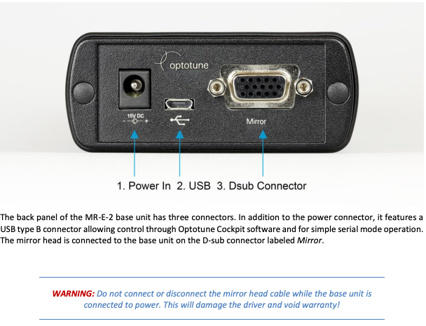
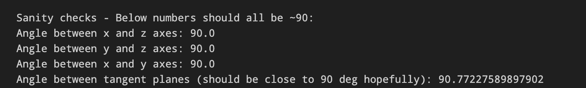
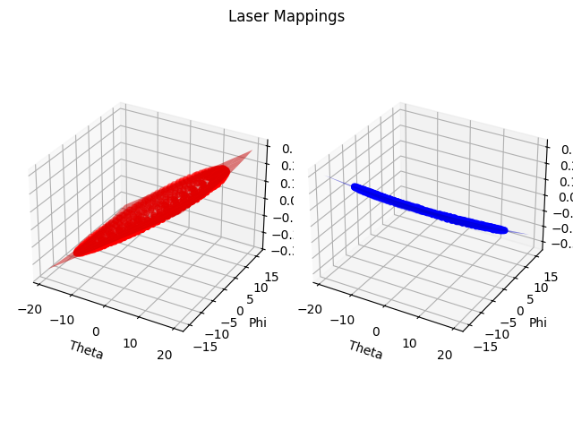

# Phaser 
This repo contains all code for the paper Set Phasers to Stun: Beaming Power and Control to Mobile Robots with Laser Light (link coming soon!). We also provide a detailed guide for replicating the Phaser tracking and laser steering design, which enables integration of 3D object tracking via stereo-vision with any laser steering device. 

## Contents
1. [Provided Code](#provided-code)
2. [Tracking and Steering System Guide](#tracking-and-steering-system-guide)

    2. [Setup](#setup)
        1. [Software](#software)
        2. [Hardware](#hardware)
    3. [Calibration](#calibration)
        1. [Stereo-Camera Calibration](#stereo-camera-calibration)
        2. [Laser Pose Calibration](#laser-pose-calibration)
        3. [Mapping](#mapping)
    4. [Deployment](#deployment)
    5. [Build Your Own Tracking and Steering System with Our Code](#build-your-own-tracking-and-steering-system-with-our-code) 

## Provided Code
Resources in this repo are organized into three folders:

1. [track_steer](track_steer) Code, Jupyter notebooks, and example data for calibrating and deploying a stereo-vision-based tracking and laser steering system using Phaser methodologies.
2. [laser_modulation](laser_modulation): Code and illustrative Jupyter notebook for FSK current-modulation of laser light via Rohde and Schwarz power supply serial interface.
3. [millimobile](millimobile): Firmware used in the paper evaluation to receive laser data and respond to laser-provided commands onboard MilliMobile robots.

## Tracking and Steering System Guide
This section details the calibration and deployment procedure for the Phaser tracking and steering system. It is based upon our particular prototype (see the paper for more details), but the majority of the code and instructions hold for any co-located stereo-pair and steering device. See [Build Your Own Tracking and Steering System with Our Code](#build-your-own-tracking-and-steering-system-with-our-code) for information on how to adapt the resources here to your own tracking and steering system for varied laser-based applications.

### Setup
Some steps in this section are specific to our prototype, which uses Allied Vision cameras and an Optotune fast-steering mirror.

#### Software
1. Install the [VimbaX SDK](https://www.alliedvision.com/en/products/software/vimba-x-sdk/#c13326).
2. Create a conda environment from [phaser_env.yml](phaser_env.yml). Run all Phaser code in this environment.
3. All code and examples for the tracking and steering module can be found in this folder of the repo. You should only need to open and/or run the following scripts: 
    * [cam_data_collection.py](cam_data_collection.py): Used for capturing video on each of the stereo cameras. You’ll need this to record the videos for calibration.
    * [camera_settings.py](camera_settings.py): Contains parameters (e.g., exposure, gain, contrast, binning) for both cameras in the prototype. A different parameter set is defined for each calibration stages and deployment. You may need to edit some parameters (typically only gain and exposure) depending on the environmental conditions.
    * [laser_pose_recovery.ipynb](laser_pose_recovery.ipynb): Guides you through the process of recovering the laser pose from laser scanning video as part of calibration, supporting visualization of each step. 
    * [mapping.ipynb](mapping.ipynb): Guides you through the process of mapping angles to steering commands using laser spiral scanning video as part of calibraiton, supporting visualization of each step.
    *  [deploy.py](deploy.py): Automates mobile target tracking and steering of the laser beam post-calibration.
    *  [tracking_vis.py](tracking_vis.py): Allows visualization of the blob detection and tracking in the stereocamera stream. This can be helpful for visualizing the effects of different camera parameters when tuning them.
      
    The remaining contents in this folder are described below for completeness:
    * [geometry.py](geometry.py): Utilities for geometric transforms and equation solving.
    * [im_proc.py](im_proc.py): Image transformations and blob detection.
    * [laser_calibration.py](laser_calibration.py): Implements logic of geometric laser pose recovery.
    * [localization.py](localization.py): 3D localization of target via stereo-cameras.
    * [manual_steering.py](manual_steering.py): Allows steering of the laser by manually commanding OptoTune mirror.
    * [mirrors.csv](mirrors.csv): Record of all steerable mirrors in the MobileX lab.
    * [lib](lib): Core library for interfacing with the mirror and AlliedVision camera.
    * [experiments](experiments): Miscellaneous files involved in development and testing of Phaser tracking and steering.
    * [params](params): Houses example stereo-camera, laser pose, and mapping parameters.
    * [stereo_calibration_input](stereo_calibration_input): Houses example high-quality input for the stereo-camera calibration stage of overall system calibration. Also contains checkerboard pattern PDF.
    * [pose_recovery_input](pose_recovery_input): Houses example high-quality input for the laser pose recovery stage of calibration.
    * [mapping_input](mapping_input): Houses example high-quality input for the mapping stage of calibration.

#### Hardware
1. Plug both Allied Vision cameras into your computer via its USB-B connector.  
2. Plug the OptoTune mirror driver into your computer via its Dusb connector. 
3. Supply power to the mirror driver. Make sure to never detach the Dusb connector from the Opotunt mirror driver (referred to as the base unit in the image below) when power is supplied. 

    

4. Adjustments. The Phaser prototype requires little manual adjustments or tuning. Assuming the laser diode module has already been installed, you should only need to touch two hardware components at any time during operation. 
    * Switchable optical filters. During calibration, we want the system to be able to view and localize the laser spot, requiring a filter that passes light at the laser wavelength (or no filter at all). During deployment, we want to block the laser light to prevent interference with the tracking of the target. To accommodate this the prototype is equipped with switchable optical filters, which can be shifted into either mode - **NONE** or **BLOCK** -  by simply pushing the apparatus up/down, as demonstrated below. Make sure to ensure that the filters have been shifted to the correct mode during each calibration stage and operation. All steps below will specify the required filter operation mode.
          

            
        
 
    * Laser module position. The laser diode in the laser module, marked below, should be positioned so that when zero voltage is applied to the mirror, the beam exits at roughly 0 degrees in both the X and Y directions. This can be tuned using the knobs on the XY mount. Additionally, the beam’s divergence can be tuned by sliding the module along the rails, which changes the diode’s depth relative to the aspheric lens. I recommend adjusting the depth for divergence purposes, and then making XY adjustments. The XY position doesn’t need to be absolutely perfect; the calibration procedure handles misalignment. A better alignment simply means that Phaser will have less clipping of the beam by the mirror enclosure and thus larger steering range. The image below shows XY mount knob, alongside examples of a well-centered and well-collimated laser exiting the prototype.
    

        
    

5. Besides the Phaser prototype itself, you’ll need a checkerboard with 5x8 29 mm squares for stereo-camera calibration. A PDF of this can be found in [stereo_calibration_input](stereo_calibration_input), and printed and pasted to a rigid board. Make sure to paste with minimal wrinkles or bends, as the planar geometry of the board is essential to proper stereo-camera calibration.

### Calibration

Calibration consists of three stages that must be performed sequentially. 
1. Stereo-camera calibration
2. Laser pose recovery
3. Steering device mapping
Each part takes as input a video of the checkerboard captured from the stereo-camera. Technically a continuous video can be taken and used for all stages, but in practice it is easier to capture one individual video for each stage. 

Do not jostle or change component positions between the calibration and deployment stages. Slight shifts of components within the prototype necessitate re-calibration. 

#### Stereo-Camera Calibration

Phaser’s stereo-cameras are calibrated with a traditional checkerboard procedure. 
1. Switch filters to NONE.
2. Keep the laser off. 
3. Collect checkerboard images for stereo-calibration. To do so , run the function [dual_vimba_cap]([https://github.com/MobileX-CU/PowerDelivery/blob/main/system/v4/controller/cam_data_collection.py#L320) in [cam_data_collection.py](cam_data_collection.py), specifying the path to the folder to save images, and also whether you want to collect in manual mode.  Collecting in manual mode means you will be prompted to accept frames before saving them to use for calibration. Images from each camera will be saved in a RIGHT and LEFT folder at your specified path. An example of a good set of stereo-calibration images can be found in [stereo_calibration_input/example/images](stereo_calibration_input/example/images). Some general Tips for collecting good calibration images:
    * Use manual mode to ensure the images used for the stereo-camera calibration are high-quality. You can move the checkerboard and then when happy with the position, capture and accept a frame for saving.
    * Ensure the exposure and gain (set within the entries of [camera_settings.py](camera_settings.py) starting with “checkerboard”) are sufficient to see the corners and definition of the checkerboard well, but avoid oversaturation or exposure of the images (i.e., we don’t want the frames to be too bright).
    * Capture images with the checkerboard at a range of positions and angles in both camera views, with it fully visible in a majority. It’s typically good to have the checkerboard relatively close to the cameras to ensure high resolution of the board in images. Around 50 diverse images should be sufficient.
    * Aim for a reprojection error well below 1. 
4. Run stereo-calibration by instantiating a [StereoCameraCalibrator](https://github.com/MobileX-CU/PowerDelivery/blob/main/system/v4/controller/stereo_calibration.py#L161) in [stereo_calibration.py]( stereo_calibration.py) with the first two arguments changed to the path of your images captured in step 3 above. The function will return the parameters of the stereo-pair. Save these as a pkl file.

#### Laser Pose Calibration

Laser pose calibration requires a set of images showing the laser spot after scanning along its X and Y axes and striking the checkerboard at several different depths. Technically we only need a set of images at two depths. However, I find that it’s better to use at least four depths. 
1. Keep the filters at **NONE**. 
2. Turn on the laser, keeping the current quite low. We don’t need a very bright spot for this. 
3. Have handy some apparatus for fixing a planar surface at several depths relative to the system. You will need to have it absolutely still during each set of scans. Some tips:
    * I recommend using a solid colored surface rather than the checkerboard, just because the spot can register in the images as distorted if it strikes a patterned area. We want it to be a well-defined circle.
    * Use depths separated by at least around 15cm, and within ~30-80cm of the prototype cameras.
    * Make sure at each depth, the full scanning plane is visible in both cameras.
5. Collect the camera data for pose recovery. To do so, run [pose_recovery_collection](https://github.com/MobileX-CU/PowerDelivery/blob/main/system/v4/controller/cam_data_collection.py#L190) in [cam_data_collection.py](cam_data_collection.py), specifying the path to the directory to save images, the number of depths you will scan at, and the mirror range scale (keep this at 1). The script will steer the laser to spots along its X and Y axes to trace an X-mark. At each scan point, it will capture images which you can accept. An example of good images can be found at [pose_recovery_input/images/](pose_recovery_input/images/) for 4 depths (i.e., planes). Some tips:
    * **If the spot is not on the board, DON’T accept the images. It’s critical that all images of spots are spots on the board.**
    * In the example images, you can see that the laser spot appears bright and distinct in the frames. This is ideal. This can be achieved by tuning the exposure/gain of the cameras as well as the laser power. We don’t want the laser spot to be too bright though, otherwise it can appear kind of distorted in images which is not good for blob detection accuracy.
    *  If the spot has just moved off the board, you can move to the next axis immediately rather than wait for all of the rest of the scans on the axis.  When the script indicates that it’s ready to scan at the next depth, move the checkerboard to a new depth relative to the stereo-camera
6. Run the pose recovery algorithm. To do so, run [laser_pose_receovery.ipynb](laser_pose_receovery.ipynb). Update the variables images_path, points_path, stereo_params_path, num_depths, and laser_pose_path appropriately. The result of the algorithm is the laser pose parameters saved at the path specified by laser_pose_path.
    * The first thing the notebook will do is extract the 2D points corresponding to the laser spot on the plane during all scan images by running blob detection. If the manual_approve argument to get_laser_pose_recovery_points2d is True, you will be prompted to approve all blob detections before saving them for future use in the pose recovery process. It’s a good idea to do this, because high-quality, accurate blobs are important for future steps of pose recovery.
    * Once 2D point extraction is done, the rest is automated.
    * Run the notebook as it is in the Github to see example correct outputs at each step. An important intermediate to check is the angle between the tangent planes outputted by the script (pictured below). If it is not close to 90, your scan points are likely not good enough. 
    

            
    
 
   
#### Mapping

The final stage of calibration determines the relationship between outgoing laser angles and steering commands to the mirror by fitting a function to spiral scan points. 
1. Keep the filters at **NONE**. 
2. Turn on the laser, keeping the current quite low. We still don’t need a very bright spot for this. 
3. Prepare a large planar surface for the spiral scan to be performed on. Technically this surface could be the checkerboard, but I recommend a larger solid-colored surface like the floor in the lab. This surface should ideally be at least 80 cm from the system cameras, to maximize the area of the surface as simultaneously viewed by both cameras. 
4. Collect the camera data for mapping. To do so, run [mapping_collection](https://github.com/MobileX-CU/PowerDelivery/blob/main/system/v4/controller/cam_data_collection.py#L66) in [cam_data_collection.py](cam_data_collection.py), specifying the path to the directory to save images, whether or not you want to manually approve each scan point (which is not really necessary for this stage, unlike in the laser poser recovery stage where it is recommended), the mirror range scale (keep this at 1), and the spiral_scale. The script will steer the laser in a spiral and take a picture at each scan point. Some notes and tips:
    * The spiral scale is proportional to the diameter of the spiral that will be scanned. You can tune this based on the size of your available scanning plane.
    * As in the laser pose recovery stage, we want the laser spot to appear very bright and distinct in the frames. This can be achieved by tuning the exposure/gain of the cameras as well as the laser power. We don’t want the laser spot to be too bright though, otherwise it can appear kind of distorted in images which is not good for blob detection accuracy. 
6. Run the mapping algorithm. To do so, run [mapping.ipynb](mapping.ipynb). Update the variables `stereo_params_path`, `laser_pose_path`, `images_path`, and `points_path` appropriately. The result of the algorithm is the mapping parameters saved as mir_x_popt.npy and mir_y_popt.npy in output folder path specified in `get_mapping_functions()`. Some notes:
    * The first thing it will do is extract the 2D points corresponding to the laser spot on the plane during all scan images by running blob detection. If the manual_approve argument to `get_mapping_points2d` is True, you will be prompted to approve all blob detections before saving them for future use in the mapping process. It’s a good idea to do this, because high-quality, accurate blobs are important for future steps of mapping.
    * Once 2D point extraction is done, the rest is automated.
    * Run the notebook as it is in the Github to see example correct outputs at each step. It’s important thing to see is relatively well-defined spirals and a reasonable fitted plane in 3D, like below (from the notebook output).
    

            
    
 
   

### Deployment

With calibration done, the deployment is relatively simple, automated fully by [deploy.py](deploy.py). It’s important to not jostle or move between calibration and deployment. Slight shifts of components within the prototype could render the parameters outdated.
1. Set the filters to **BLOCK**.
2. Obtain your retroreflective marker.
3. Edit the variables `stereo_params_path`, `laser_params_path`, `mirror_x_params_path`, and `mirror_y_params_path` in [deploy.py](deploy.py) with paths to the parameters you recovered in your calibration stage.
4. Turn on the LEDs. 
5. Tune the deployment exposure and gain in [camera_settings.py](camera_settings.py) so that the background and scene are very dark. The retroreflector should appear as a bright blob against a largely black background background. To test out different exposure and gains, it is helpful to use [tracking_vis.py](tracking_vis.py)
6. Turn on the laser with whatever power desired for your tests/operation setting. 
7. Run [deploy.py](deploy.py) and tracking and steering will run automatically and continuously. 

### Build Your Own Tracking and Steering System with Our Code
Coming soon!